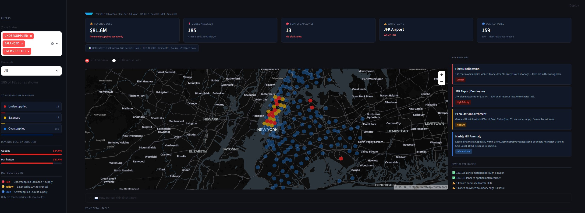
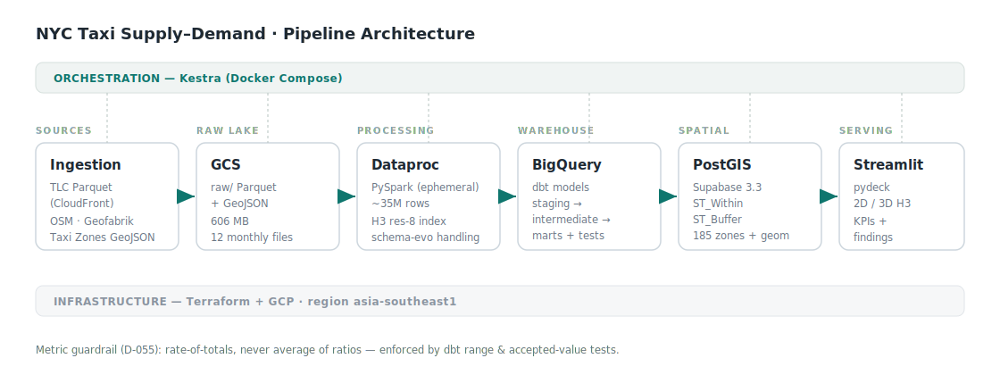

# NYC Taxi Supply–Demand Gap Analysis

**Where does NYC's taxi fleet sit idle while riders go unserved — and what does that cost?**

An end-to-end geospatial data pipeline that quantifies the supply–demand mismatch across New York City at H3 hexagon resolution, using a full year of TLC Yellow Taxi trip records.


**[🚀 Live Dashboard →](https://nyctaxisupplydemandanalysis.streamlit.app)**
---

## TL;DR

- **$81.6M/year** in estimated lost revenue, concentrated in just **13 undersupplied zones**.
- Meanwhile **159 zones are oversupplied** — taxis are in the wrong place, not in short supply.
- **The story is fleet *misallocation*, not a shortage.** Rebalancing beats expanding the fleet.
- **JFK Airport alone** accounts for **$26.3M (32% of total loss)** at a 79% unmet-demand rate. LaGuardia and the Garment District (Penn Station catchment) follow.

> The core takeaway is an operations decision, not a metric: where you move existing supply matters more than how much supply you add.

---

## The Problem

Most taxi/ride-hailing "demand heatmaps" stop at *where rides happen*. That answers nothing actionable — high-volume zones are obvious. The operationally useful question is the **gap**: where does demand systematically outrun the supply that actually shows up, and where does supply sit idle?

This project frames every H3 cell in NYC on a supply–demand axis and turns the gap into a dollar figure an operations team could act on.

### Questions this answers

1. **Which zones are consistently high-demand but low-supply?** → 13 undersupplied zones, isolated from 159 oversupplied ones.
2. **What is the estimated revenue loss from the gap?** → ~$81.6M/year (upper bound — see Limitations).
3. **What predictable temporal patterns exist by hour/day?** → *Extended analysis — see the time-of-day heatmap.*

---

## What I Built

A production-shaped pipeline: ingestion → warehouse transform → spatial enrichment → serving.



| Stage | What happens |
|---|---|
| **Ingestion** | TLC trip Parquet pulled directly from CloudFront; OSM street network and taxi-zone geometries staged to object storage. Orchestrated with Kestra. |
| **Processing** | PySpark on ephemeral Dataproc clusters handles ~35M rows, schema-evolution across the 2023 mid-year format change, and H3 indexing. |
| **Warehouse** | BigQuery raw + dbt models (staging → intermediate → marts), materialization tuned per layer, with data tests as regression guardrails. |
| **Spatial layer** | PostGIS (Supabase) for `ST_Within` borough validation and `ST_Buffer` transit-hub proximity. |
| **Serving** | Streamlit dashboard — 2D/3D H3 hexagon map, KPIs, findings, and a zone detail table. |

---

## Data

| Source | Detail |
|---|---|
| **TLC Yellow Taxi 2023** | Full year, direct Parquet from the official TLC CloudFront endpoint (not the Socrata mirror). ~35M rows after filtering. |
| **NYC Taxi Zones** | GeoJSON (NYC Open Data) — dual purpose: H3 polyfill bounding + zone-name lookup. |
| **OSM street network** | Geofabrik NY State extract — 72,005 drivable segments. |
| **H3 grid** | Res-8, generated with `h3-py` — ~1,070 cells over NYC. |

Trip data is pulled directly from the official TLC endpoint (full year, not the 6-month Socrata mirror):

```
https://d37ci6vzurychx.cloudfront.net/trip-data/yellow_tripdata_2023-{01..12}.parquet
```

---

## Methodology

**Spatial unit.** Every metric is computed per H3 res-8 cell, then rolled up to TLC zone for reporting.

**Supply & demand (and its honest limit).** Demand = pickups per cell; supply = dropoffs per cell. This is a **pickup–dropoff asymmetry proxy**, *not* real-time driver availability — a dropoff is where a driver *became* available, not a guarantee they stayed. This proxy is stated plainly because pretending otherwise would be the dishonest move; the asymmetry is still a strong directional signal for where fleet sits relative to where it's hailed.

**The metric that almost shipped broken (D-055).** The first version averaged per-cell ratios up to the zone level. Sparse buckets (e.g. demand=1, supply=42) produced rates like **−41**, poisoning zone averages and surfacing nonsense. The fix: **aggregate totals, then divide once** — `unmet_rate = (Σdemand − Σsupply) / Σdemand` — never average ratios. dbt range and accepted-value tests now block this regression. This same trap is re-checked at the zone-summary layer.

**Filtering.** A 500-trip/year minimum drops low-volume cells that would otherwise game the gap rankings (243 → 185 reported cells).

**Classification.** A ±10% band: supply/demand ratio 0.9–1.1 = balanced, below = undersupplied, above = oversupplied. Revenue loss is attributed to **undersupplied zones only**.

---

## Key Findings

- **Fleet misallocation is the headline.** 159 oversupplied vs 13 undersupplied — the system has enough taxis, in the wrong cells.
- **JFK Airport:** $26.3M lost, 79% unmet demand — the single largest opportunity.
- **LaGuardia Airport:** ~$15.0M, surfaced only after the metric fix.
- **Garment District (within 800m of Penn Station):** ~$11.4M — a commuter-exit gap revealed by `ST_Buffer` proximity analysis.
- **By borough:** Queens ~$44.0M (airport-driven), Manhattan ~$37.6M (commuter-driven). Brooklyn and the Bronx show no undersupplied zones.

---

## Honest Limitations

A portfolio that hides its caveats is less trustworthy, not more. The known boundaries of this analysis:

1. **Revenue loss is an estimated upper bound**, not observed lost revenue. It applies an aggregate fare ratio to unmet demand; real captured revenue would be lower due to elasticity and substitution.
2. **Supply/demand is a dropoff/pickup proxy** (see Methodology) — it approximates fleet position, not live driver state.
3. **One year, one mode.** 2023 Yellow Taxi only — no green cabs, no FHV/rideshare, no seasonality across years.
4. **Marble Hill anomaly:** labeled Manhattan administratively but spatially in the Bronx (Harlem Ship Canal, rerouted 1895). Both labels are correct in their own frame; $0 revenue impact. Surfaced by `ST_Within` validation — included to show the spatial check works.
5. **Spatial validation:** 181/185 cells matched a borough polygon; 180/181 label-correct; 4 cells sit on water/boundary edges with $0 loss.

---

## Tech Stack

| Layer | Tool |
|---|---|
| Orchestration | Kestra (Docker Compose) |
| Infrastructure | Terraform + GCP |
| Processing | PySpark on ephemeral Dataproc |
| Warehouse | BigQuery |
| Transformation | dbt (staging / intermediate / marts) + data tests |
| Spatial DB | PostGIS (Supabase) |
| Serving | Streamlit + pydeck |
| Spatial indexing | H3 (res-8) |
| Geospatial libs | GeoPandas, Shapely, h3-py, osmium-tool |

---

## Run It Locally

```bash
# 1. Clone + virtualenv
git clone https://github.com/mahardisetyoso/nyc_taxi_supply_demand_analysis
cd nyc_taxi_supply_demand_analysis
python -m venv .venv && source .venv/bin/activate    # Windows: .\.venv\Scripts\Activate.ps1
pip install -r requirements.txt

# 2. Configure env (.env in project root, gitignored)
#    SUPABASE_DB_URL=postgresql://...
#    NYC_APP_TOKEN=...

# 3. Auth GCP for dbt (ADC oauth) and verify
gcloud auth application-default login
cd dbt/nyc_taxi_supply_demand && dbt debug && dbt build

# 4. Launch dashboard
cd ../.. && streamlit run streamlit/app.py
```

---

## Decisions Log

Every non-obvious technical choice is recorded in [`DECISIONS.md`](DECISIONS.md) (D-001 … D-056), including schema-evolution handling, the rate-aggregation fix (D-055), and the local-dev migration (D-056).

---

## About

Built by **Mahardi Setyoso** — 8 years in geospatial product operations, transitioning into geospatial data engineering. This project is original problem framing, not a course exercise: the supply–demand gap question, the H3 methodology, and the operations-oriented insight are the point.